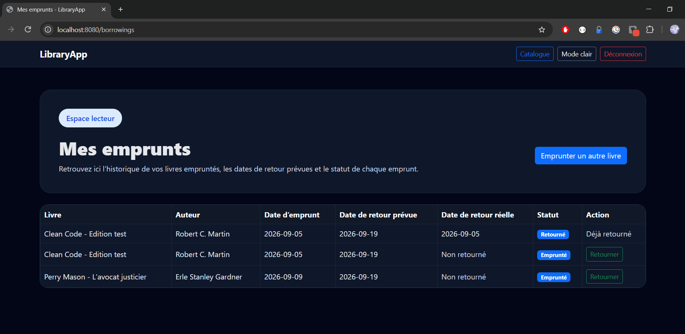
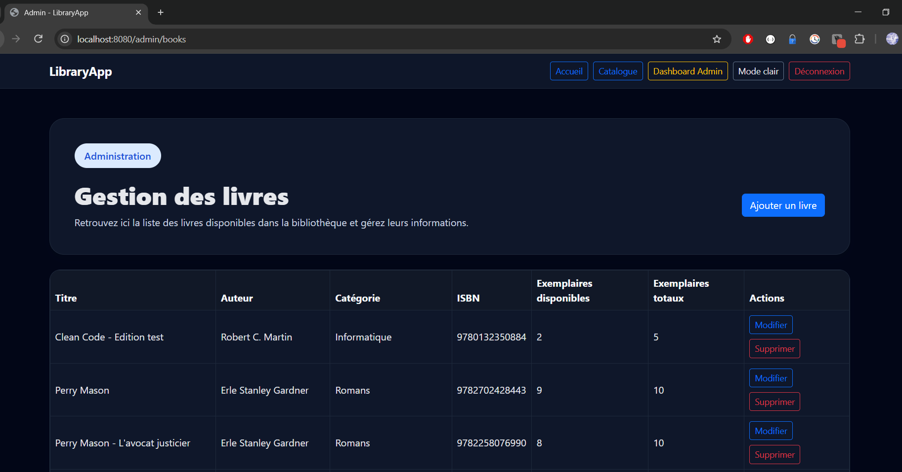
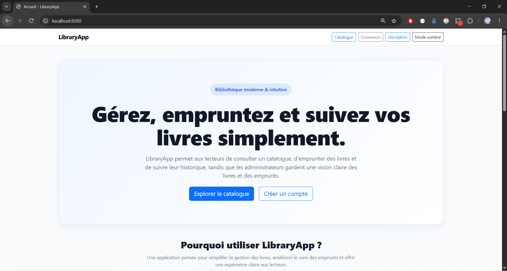

🇬🇧 [English version](README.md)

# 📚 LibraryApp

LibraryApp est une application web full-stack de gestion de bibliothèque développée avec **Java 17, Spring Boot, Spring MVC, Spring Data JPA, Spring Security, Thymeleaf, MySQL, Bootstrap 5 et JavaScript**.

L’application permet aux utilisateurs de consulter le catalogue, d’emprunter et retourner des livres disponibles, puis de suivre leur historique d’emprunts. Les administrateurs peuvent quant à eux gérer le catalogue et consulter l’ensemble des emprunts réalisés.

Ce projet a été développé comme un projet portfolio complet en Java / Spring Boot, avec une attention particulière portée à l’architecture backend, aux règles métier, à la sécurité, aux tests et à la maintenabilité du code.

---

## ✨ Fonctionnalités

### 👤 Utilisateurs non connectés

* Consulter l’ensemble du catalogue
* Filtrer les livres par catégorie
* Consulter les informations détaillées d’un livre
* Vérifier sa disponibilité
* Afficher automatiquement les couvertures via l’API Open Library Covers
* Utiliser un visuel de remplacement lorsqu’aucune couverture n’est disponible
* Utiliser le mode clair / sombre

### 🔐 Utilisateurs inscrits

* Créer un compte
* Se connecter de manière sécurisée
* Emprunter un livre disponible
* Choisir une durée d’emprunt comprise entre 1 et 30 jours
* Consulter son historique personnel d’emprunts
* Retourner un livre emprunté
* Suivre le statut et les dates de retour de ses emprunts

### 🛡️ Administrateurs

* Accéder à un dashboard d’administration protégé
* Ajouter de nouveaux livres
* Modifier les livres existants
* Gérer le nombre total d’exemplaires
* Supprimer les livres lorsque les règles métier l’autorisent
* Consulter tous les emprunts réalisés
* Suivre la disponibilité des ouvrages et l’activité d’emprunt

---

## 🧠 Règles métier

LibraryApp contient plusieurs règles métier implémentées dans la couche Service.

### Emprunt

Un utilisateur ne peut pas :

* emprunter un livre lorsqu’aucun exemplaire n’est disponible ;
* emprunter deux fois le même livre tant qu’un emprunt actif existe déjà ;
* choisir une durée d’emprunt inférieure à 1 jour ;
* choisir une durée d’emprunt supérieure à 30 jours.

Lorsqu’un livre est emprunté :

```text
availableCopies = availableCopies - 1
```

Lorsqu’un livre est retourné :

```text
availableCopies = availableCopies + 1
```

Le nombre d’exemplaires disponibles ne peut jamais dépasser le nombre total d’exemplaires.

### Gestion des livres

Lorsqu’un administrateur modifie le nombre total d’exemplaires, LibraryApp conserve correctement le nombre d’exemplaires actuellement empruntés.

Exemple :

```text
totalCopies     = 10
availableCopies = 7

Exemplaires empruntés = 10 - 7 = 3
```

Si l’administrateur modifie le nombre total d’exemplaires à `8` :

```text
availableCopies = 8 - 3
                = 5
```

LibraryApp empêche également l’administrateur de définir un nombre total d’exemplaires inférieur au nombre d’exemplaires actuellement empruntés.

Un livre possédant déjà un historique d’emprunt ne peut pas être supprimé.

---

## 🏗️ Architecture

L’application suit une architecture Spring en couches :

```text
Navigateur
   │
   ▼
Controller
   │
   ▼
Service
   │
   ▼
Repository
   │
   ▼
Base de données MySQL
```

### Principaux packages

Générale : 
```text
src
├── main
│   ├── java
│   │   └── com.libraryapp
│   │       ├── config
│   │       ├── controller
│   │       ├── entity
│   │       ├── form
│   │       ├── repository
│   │       ├── service
│   │       └── LibraryappApplication
│   │
│   └── resources
│       ├── static
│       │   ├── css
│       │   └── js
│       ├── templates
│       └── application.properties
│
└── test
    └── java
```

Détails :
```text
src/main/java/com/libraryapp
│
├── config
│   └── Configuration Spring Security
│
├── controller
│   ├── Contrôleurs publics
│   ├── Contrôleurs d’authentification
│   ├── Contrôleurs d’emprunt
│   └── Contrôleurs d’administration
│
├── entity
│   ├── AppUser
│   ├── Book
│   └── Borrowing
│
├── form
│   └── Objets de formulaire / validation
│
├── repository
│   ├── AppUserRepository
│   ├── BookRepository
│   └── BorrowingRepository
│
└── service
    ├── UserService
    ├── BookService
    ├── BorrowingService
    └── CustomUserDetailsService
```

---

## 🗃️ Modèle de données

LibraryApp repose principalement sur trois entités.

### AppUser

Représente un utilisateur de l’application.

Principaux champs :

```text
id
firstName
lastName
email
password
role
createdAt
```

Rôles disponibles :

```text
USER
ADMIN
```

### Book

Représente un livre du catalogue.

Principaux champs :

```text
id
title
author
isbn
category
description
totalCopies
availableCopies
createdAt
```

### Borrowing

Représente la relation entre un utilisateur et un livre emprunté.

Principaux champs :

```text
id
user
book
borrowDate
dueDate
returnDate
status
createdAt
```

Statuts d’emprunt :

```text
BORROWED
RETURNED
LATE
```

---

## 📖 Catégories de livres

LibraryApp prend actuellement en charge les catégories suivantes :

```text
Romans
Sciences
Histoire
Informatique
Développement personnel
Théologie
Autres
```

---

## 🖼️ Open Library Covers API

Les couvertures de livres sont récupérées automatiquement à partir de leur ISBN via **Open Library Covers API**.

Exemple :

```text
https://covers.openlibrary.org/b/isbn/{ISBN}-M.jpg?default=false
```

LibraryApp retire automatiquement les espaces et tirets présents dans l’ISBN avant de construire l’URL.

Exemple :

```text
978-0-13-235088-4
```

devient :

```text
9780132350884
```

### Stratégie de fallback

```text
ISBN disponible
      │
      ▼
Open Library Covers API
      │
 ┌────┴────┐
 │         │
Succès    Erreur
 │         │
 ▼         ▼
Image     Placeholder
du livre  LibraryApp
```

Un script JavaScript détecte les couvertures indisponibles et remplace automatiquement les images cassées par un placeholder LibraryApp.

Cette approche évite également de stocker manuellement des couvertures protégées par le droit d’auteur dans le projet.

---

## 🌗 Mode clair / sombre

LibraryApp propose un mode clair et un mode sombre.

Le thème sélectionné est enregistré dans :

```javascript
localStorage
```

avec la clé :

```text
libraryapp-theme
```

Cela permet de conserver le choix de l’utilisateur lors de la navigation entre les pages et après un rechargement du navigateur.

---

## 🔐 Sécurité

La sécurité est gérée avec **Spring Security**.

Routes publiques :

```text
/
/books
/books/**
/login
/register
```

Routes accessibles aux utilisateurs authentifiés :

```text
/borrow/**
/borrowings
```

Routes administrateur protégées :

```text
/admin/**
```

Un utilisateur possédant uniquement le rôle `USER` ne peut pas accéder aux ressources d’administration.

Les accès non autorisés sont gérés via une page personnalisée **403**.

---

## ⚠️ Gestion des erreurs

LibraryApp possède des pages d’erreur personnalisées :

```text
403 — Accès interdit
404 — Ressource introuvable
500 — Erreur interne du serveur
```

Par exemple, demander un livre inexistant :

```text
/books/999999
```

affiche la page personnalisée 404.

---

## 🧪 Tests automatisés

Le projet contient des tests unitaires et des tests de contexte utilisant notamment :

* JUnit
* Mockito
* Spring Boot Test
* Spring Security Test

La V1 contient actuellement :

```text
Tests run: 10
Failures: 0
Errors: 0
Skipped: 0

BUILD SUCCESS
```

### BookService

Principaux scénarios testés :

* Créer un livre avec un ISBN disponible
* Refuser un ISBN déjà utilisé
* Empêcher la suppression d’un livre possédant un historique d’emprunt

### BorrowingService

Principaux scénarios testés :

* Emprunter correctement un livre
* Diminuer le stock disponible
* Empêcher un double emprunt actif
* Refuser un emprunt lorsque le stock est épuisé
* Retourner un livre
* Augmenter le stock disponible après un retour

### UserService

Principaux scénarios testés :

* Inscrire un nouvel utilisateur
* Encoder son mot de passe
* Attribuer automatiquement le rôle USER
* Refuser un email déjà utilisé

---

## 🛠️ Stack technique

### Backend

* Java 17
* Spring Boot 4.1.0
* Spring MVC
* Spring Data JPA
* Spring Security
* Hibernate
* Maven

### Frontend

* Thymeleaf
* HTML5
* CSS3
* Bootstrap 5
* JavaScript

### Base de données

* MySQL

### Service externe

* Open Library Covers API

### Tests

* JUnit
* Mockito
* Spring Boot Test
* Spring Security Test

### Versioning

* Git
* GitHub

---

## 🚀 Lancer le projet en local

### Prérequis

Assurez-vous de disposer de :

```text
Java 17
MySQL
Git
```

Le projet inclut Maven Wrapper, il n’est donc pas nécessaire d’installer Maven globalement.

### 1. Cloner le dépôt

```bash
git clone https://github.com/Stuna123/libraryapp.git
```

### 2. Ouvrir le projet

```bash
cd libraryapp
```

### 3. Configurer la base de données

Créer une base MySQL destinée à LibraryApp.

Puis configurer la connexion dans la configuration Spring.

Exemple :

```properties
spring.datasource.url=jdbc:mysql://localhost:3306/libraryapp_db
spring.datasource.username=YOUR_USERNAME
spring.datasource.password=YOUR_PASSWORD
```

Ne jamais publier de vrais identifiants de base de données dans GitHub.

### 4. Lancer l’application

Sous Windows :

```powershell
.\mvnw spring-boot:run
```

Sous Linux / macOS :

```bash
./mvnw spring-boot:run
```

L’application sera disponible sur :

```text
http://localhost:8080
```

---

## 🧪 Lancer les tests

Sous Windows :

```powershell
.\mvnw clean test
```

Sous Linux / macOS :

```bash
./mvnw clean test
```

Résultat attendu pour la V1 :

```text
Tests run: 10
Failures: 0
Errors: 0
Skipped: 0

BUILD SUCCESS
```

---

## 📸 Captures d’écran

Les captures finales seront ajoutées après le déploiement.

Captures prévues :

```text
Page d'accueil


Catalogue


Détail d'un livre


Historique des emprunts


Dashboard administrateur


Gestion des livres


Mode clair

```

---

## 🌍 Démonstration en ligne

Déploiement en préparation.

L’URL de production sera ajoutée ici une fois l’application déployée.

---

## 🔮 Améliorations possibles

Quelques pistes envisagées pour les futures versions :

* Menu hamburger responsive
* Pagination
* Recherche avancée de livres
* Tri du catalogue
* Gestion du profil utilisateur
* Notifications par email
* Gestion automatique des retards
* API REST
* Architecture avec DTO
* PostgreSQL pour la production
* Docker
* Pipeline CI/CD
* Tests d’intégration supplémentaires
* Statistiques administrateur
* Récupération automatique de métadonnées de livres via une API externe

---

## 🎯 Ce que ce projet m’a permis d’apprendre

LibraryApp m’a permis de renforcer mes connaissances sur :

* l’architecture en couches avec Spring Boot ;
* l’injection de dépendances ;
* Spring MVC ;
* l’intégration de Thymeleaf ;
* Spring Data JPA ;
* les relations entre entités ;
* Spring Security ;
* l’authentification et l’autorisation ;
* les règles métier dans la couche Service ;
* la validation de formulaires ;
* la gestion des exceptions ;
* les tests unitaires avec Mockito ;
* Git et GitHub ;
* l’intégration d’une API externe ;
* les stratégies de fallback en JavaScript ;
* la conception d’une interface responsive ;
* la cohérence et la gestion d’un stock.

L’un des objectifs principaux du projet n’était pas uniquement de produire une application fonctionnelle, mais aussi de comprendre les responsabilités de chaque couche et d’être capable d’expliquer le parcours complet d’une requête dans l’application.

---

## 👨‍💻 Auteur

**Francis Tabora**

Software Engineer / Full-Stack Developer

GitHub :
https://github.com/Stuna123

Portfolio :
https://portfolioftab.netlify.app/index-en

---

## 📌 État du projet

```text
LibraryApp V1.0.0
Statut : V1 fonctionnelle terminée
Tests automatisés : 10 / 10 réussis
Déploiement : prochaine étape
```
