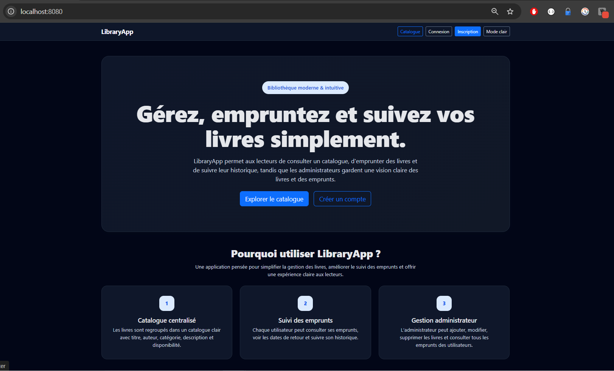
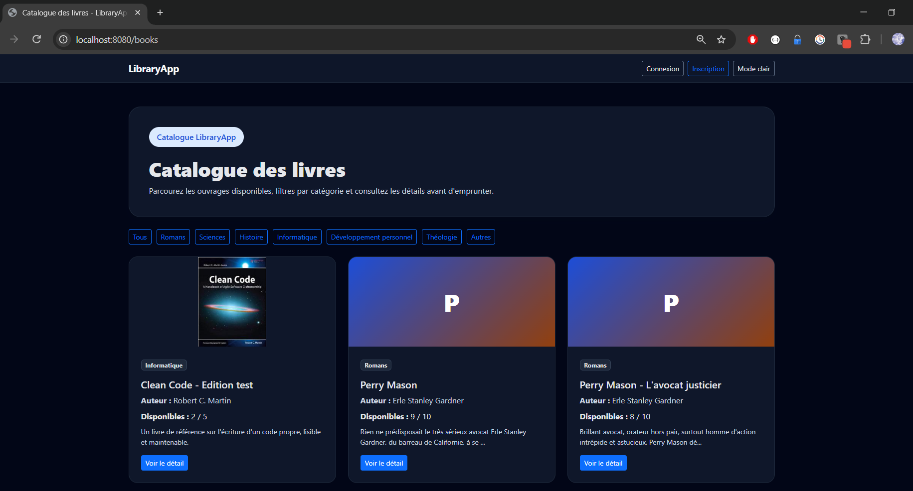
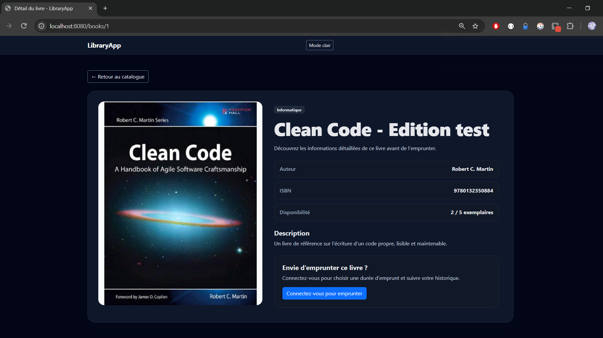
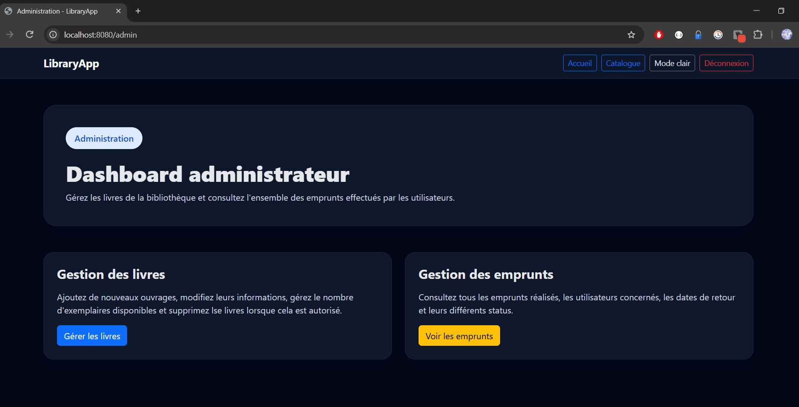

🇫🇷 [Version française](README-FR.md)

# 📚 LibraryApp

LibraryApp is a full-stack web application for managing a library, built with **Java 17, Spring Boot, Spring MVC, Spring Data JPA, Spring Security, Thymeleaf, MySQL, Bootstrap 5 and JavaScript**.

The application allows users to browse books, borrow and return available copies, track their borrowing history, while administrators can manage the catalogue and monitor all borrowing activity.

This project was developed as a complete Java / Spring Boot portfolio project, with a strong focus on backend architecture, business rules, security, testing and maintainable code.

---

## ✨ Features

### 👤 Public users

* Browse the complete book catalogue
* Filter books by category
* View detailed information about a book
* View book availability
* Display book covers through the Open Library Covers API
* Automatic fallback when a cover is unavailable
* Light / Dark mode

### 🔐 Registered users

* Create an account
* Log in securely
* Borrow an available book
* Choose a borrowing duration between 1 and 30 days
* View personal borrowing history
* Return borrowed books
* Track borrowing status and return dates

### 🛡️ Administrators

* Access a protected administration dashboard
* Add new books
* Edit existing books
* Manage the total number of copies
* Delete books when business rules allow it
* View all borrowings made by users
* Monitor availability and borrowing activity

---

## 🧠 Business Rules

LibraryApp contains several business rules implemented in the service layer.

### Borrowing

A user cannot:

* borrow a book when no copy is available;
* borrow the same book twice while an active borrowing already exists;
* choose a borrowing duration shorter than 1 day;
* choose a borrowing duration longer than 30 days.

When a book is borrowed:

```text
availableCopies = availableCopies - 1
```

When the book is returned:

```text
availableCopies = availableCopies + 1
```

The number of available copies can never exceed the total number of copies.

### Book management

When an administrator modifies the total number of copies, LibraryApp preserves the number of books currently borrowed.

Example:

```text
totalCopies     = 10
availableCopies = 7

Borrowed copies = 10 - 7 = 3
```

If the administrator changes the total number of copies to `8`:

```text
availableCopies = 8 - 3
                = 5
```

LibraryApp also prevents the administrator from setting the total number of copies below the number of copies currently borrowed.

A book with an existing borrowing history cannot be deleted.

---

## 🏗️ Architecture

The application follows a layered Spring architecture:

```text
Browser
   │
   ▼
Controller
   │
   ▼
Service
   │
   ▼
Repository
   │
   ▼
MySQL Database
```

### Main packages

Main :
```text
src
├── main
│   ├── java
│   │   └── com.libraryapp
│   │       ├── config
│   │       ├── controller
│   │       ├── entity
│   │       ├── form
│   │       ├── repository
│   │       ├── service
│   │       └── LibraryappApplication
│   │
│   └── resources
│       ├── static
│       │   ├── css
│       │   └── js
│       ├── templates
│       └── application.properties
│
└── test
    └── java
```

More details :
```text
src/main/java/com/libraryapp
│
├── config
│   └── Spring Security configuration
│
├── controller
│   ├── Public controllers
│   ├── Authentication controllers
│   ├── Borrowing controllers
│   └── Administration controllers
│
├── entity
│   ├── AppUser
│   ├── Book
│   └── Borrowing
│
├── form
│   └── Form / validation objects
│
├── repository
│   ├── AppUserRepository
│   ├── BookRepository
│   └── BorrowingRepository
│
└── service
    ├── UserService
    ├── BookService
    ├── BorrowingService
    └── CustomUserDetailsService
```

---

## 🗃️ Data Model

LibraryApp is mainly based on three entities.

### AppUser

Represents an application user.

Main fields:

```text
id
firstName
lastName
email
password
role
createdAt
```

Roles:

```text
USER
ADMIN
```

### Book

Represents a book in the catalogue.

Main fields:

```text
id
title
author
isbn
category
description
totalCopies
availableCopies
createdAt
```

### Borrowing

Represents the relationship between a user and a borrowed book.

Main fields:

```text
id
user
book
borrowDate
dueDate
returnDate
status
createdAt
```

Borrowing statuses:

```text
BORROWED
RETURNED
LATE
```

---

## 📖 Book Categories

LibraryApp currently supports:

```text
Novel
Science
History
Computer Science
Personal Development
Theology
Other
```

---

## 🖼️ Open Library Covers API

Book covers are automatically retrieved using the book ISBN and the **Open Library Covers API**.

Example:

```text
https://covers.openlibrary.org/b/isbn/{ISBN}-M.jpg?default=false
```

LibraryApp removes spaces and hyphens from the ISBN before constructing the URL.

Example:

```text
978-0-13-235088-4
```

becomes:

```text
9780132350884
```

### Fallback strategy

```text
ISBN available
      │
      ▼
Open Library Covers API
      │
 ┌────┴────┐
 │         │
Success   Error
 │         │
 ▼         ▼
Cover    LibraryApp
image    placeholder
```

A JavaScript fallback detects unavailable covers and automatically replaces broken images with a LibraryApp placeholder.

This avoids manually storing copyrighted cover images inside the project.

---

## 🌗 Light / Dark Mode

LibraryApp supports both light and dark themes.

The selected theme is stored in:

```javascript
localStorage
```

using:

```text
libraryapp-theme
```

This allows the theme preference to remain active when navigating between pages or refreshing the browser.

---

## 🔐 Security

Security is implemented using **Spring Security**.

Public routes include:

```text
/
/books
/books/**
/login
/register
```

Authenticated users can access:

```text
/borrow/**
/borrowings
```

Administrator routes are protected:

```text
/admin/**
```

Users with the `USER` role cannot access administrative resources.

Unauthorized access is handled using a custom **403 page**.

---

## ⚠️ Error Handling

LibraryApp includes custom error pages for:

```text
403 — Forbidden
404 — Not Found
500 — Internal Server Error
```

For example, requesting a non-existing book such as:

```text
/books/999999
```

returns the custom 404 page.

---

## 🧪 Automated Tests

The project contains automated unit and application tests using:

* JUnit
* Mockito
* Spring Boot Test
* Spring Security Test

The current V1 contains:

```text
Tests run: 10
Failures: 0
Errors: 0
Skipped: 0

BUILD SUCCESS
```

Main tested areas include:

### BookService

* Create a book with an available ISBN
* Reject duplicate ISBN
* Prevent deletion when borrowing history exists

### BorrowingService

* Successfully borrow a book
* Decrease available stock
* Prevent duplicate active borrowing
* Prevent borrowing when no stock is available
* Return a book
* Increase available stock after a return

### UserService

* Register a new user
* Encode passwords
* Assign the USER role
* Reject duplicate email addresses

---

## 🛠️ Tech Stack

### Backend

* Java 17
* Spring Boot 4.1.0
* Spring MVC
* Spring Data JPA
* Spring Security
* Hibernate
* Maven

### Frontend

* Thymeleaf
* HTML5
* CSS3
* Bootstrap 5
* JavaScript

### Database

* MySQL

### External Service

* Open Library Covers API

### Testing

* JUnit
* Mockito
* Spring Boot Test
* Spring Security Test

### Version Control

* Git
* GitHub

---

## 🚀 Running the Project Locally

### Prerequisites

Make sure you have:

```text
Java 17
MySQL
Git
```

The project includes the Maven Wrapper, so installing Maven globally is not required.

### 1. Clone the repository

```bash
git clone https://github.com/Stuna123/libraryapp.git
```

### 2. Enter the project

```bash
cd libraryapp
```

### 3. Configure the database

Create a MySQL database for LibraryApp.

Then configure your database connection in your Spring configuration.

Example:

```properties
spring.datasource.url=jdbc:mysql://localhost:3306/libraryapp_db
spring.datasource.username=YOUR_USERNAME
spring.datasource.password=YOUR_PASSWORD
```

Do not commit real database credentials to GitHub.

### 4. Start the application

On Windows:

```powershell
.\mvnw spring-boot:run
```

On Linux / macOS:

```bash
./mvnw spring-boot:run
```

The application will be available at:

```text
http://localhost:8080
```

---

## 🧪 Running the Tests

Windows:

```powershell
.\mvnw clean test
```

Linux / macOS:

```bash
./mvnw clean test
```

Expected V1 result:

```text
Tests run: 10
Failures: 0
Errors: 0
Skipped: 0

BUILD SUCCESS
```

---

## 📸 Screenshots

Screenshots of the final application will be added after deployment.

Planned screenshots:

```text
Home page
```


```
Catalogue
```


Book details


Borrowing history


Admin dashboard


Book management


Light mode

```

---

## 🌍 Live Demo

Deployment in progress.

The production URL will be added here once the application is deployed.

---

## 🔮 Possible Future Improvements

Potential improvements for future versions include:

* Responsive hamburger navigation
* Pagination
* Advanced book search
* Sorting
* User profile management
* Email notifications
* Late borrowing automation
* REST API
* DTO architecture
* PostgreSQL production database
* Docker
* CI/CD pipeline
* Integration tests
* Additional admin statistics
* Automatic book metadata retrieval from an external API

---

## 🎯 What I Learned

LibraryApp helped me strengthen my understanding of:

* layered Spring Boot architecture;
* dependency injection;
* Spring MVC;
* Thymeleaf integration;
* Spring Data JPA;
* entity relationships;
* Spring Security;
* authentication and authorization;
* service-layer business rules;
* form validation;
* exception handling;
* unit testing with Mockito;
* Git workflow;
* external API integration;
* JavaScript fallback strategies;
* responsive UI design;
* maintaining stock consistency.

One of the main objectives of the project was not only to build a working application, but also to understand the responsibilities of each layer and be able to explain the complete request flow.

---

## 👨‍💻 Author

**Francis Tabora**

Software Engineer / Full-Stack Developer

GitHub:
https://github.com/Stuna123

Portfolio:
https://portfolioftab.netlify.app/index-en

---

## 📌 Project Status

```text
LibraryApp V1.0.0
Status: Functional V1 completed
Automated tests: 10 / 10 passing
Deployment: Next step
```